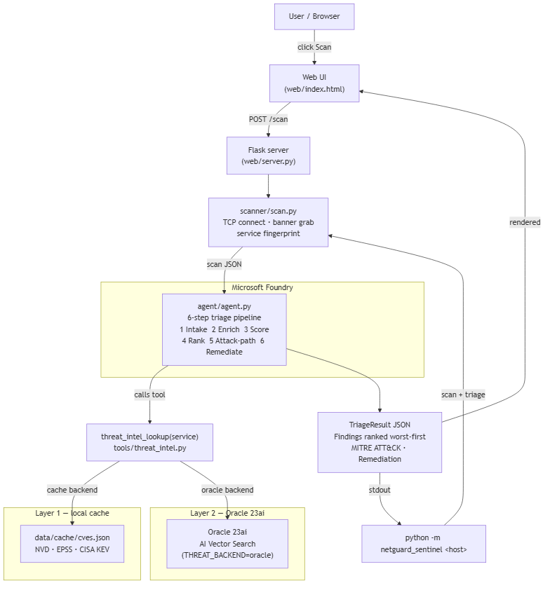

# NetGuard Sentinel

Autonomous vulnerability-triage agent built on Microsoft Foundry.

Enter a host. One click. Get back: every open service fingerprinted, each CVE scored by real-world exploitability, findings ranked worst-first, a MITRE ATT&CK attack path, and per-finding remediation ordered to break that path first.

The demo case is Apache 2.4.49 (CVE-2021-41773, on CISA's Known Exploited Vulnerabilities list, EPSS ~0.97) ranking above higher-CVSS bugs that nobody is actively exploiting. Run it locally in two commands.

This project grew out of [NetGuard](https://github.com/aimannurzharfan/Network-Scanner), a Python port scanner written earlier as a learning project. That scanner found what was running; Sentinel decides what to do about it, with the scan step built in.

**Authorized use only. Only scan hosts you own or are explicitly authorized to test.**

## How it works

Six stages, all automated:

1. **Port scan** -- threaded TCP connect scan, banner grab, service and version fingerprinted from the banner with regex (Apache/2.4.49, SSH-2.0-OpenSSH_7.4, 220 (vsFTPd 2.3.4), etc.).
2. **Vulnerability enrichment** -- calls the `threat_intel_lookup` tool, which returns CVEs with CVSS base score (NVD), EPSS exploit probability (FIRST), and CISA KEV known-exploited status.
3. **Composite risk scoring** -- combines the three signals into a 0-100 score per CVE (formula below).
4. **Contextual prioritization** -- ranks findings worst-first. A reachable, actively-exploited medium outranks an unreachable critical.
5. **Attack-path reasoning** -- maps findings to MITRE ATT&CK techniques and chains them into the likely attacker path through the host.
6. **Remediation synthesis** -- writes a per-finding fix ordered to break the attack path first, plus a one-line host risk summary.

Output is strict JSON (schema in `agent/schema.py`).

## Composite scoring formula

```
composite = round(min(1, 0.30 * (cvss / 10) + 0.50 * epss + 0.20 * kev_flag) * 100)
```

CVSS contributes 30% (severity baseline). EPSS contributes 50% (real-world exploit probability, the most predictive signal). KEV contributes 20% (active exploitation confirmed by CISA). A CVSS 9.8 bug with no known exploits scores ~29; the same bug on KEV with EPSS 0.97 scores ~91.

## Architecture



```
                          python -m netguard_sentinel <host>
                                         |
                          Web UI (Scan button)  ----POST /scan---->  Flask server
                                                                           |
                                                                    scanner/scan.py
                                                                    (TCP connect, banner)
                                                                           |
                                                               agent/agent.py (6-step)
                                                                           |
                                                                 threat_intel_lookup()
                                                                      |          |
                                                             Layer 1: cache   Layer 2: Oracle 23ai
                                                             data/cache/      AI Vector Search
                                                             (NVD/EPSS/KEV)   (semantic query)
```

Two layers, one tool interface. The agent calls `threat_intel_lookup(service)` and gets the same CVE records back regardless of which backend is active. Switch with `THREAT_BACKEND=oracle` in `.env`.

**Microsoft Foundry** (the agent LLM runtime) wires in on Day 4 (~June 9) via `agent/foundry_client.py`. Until then the triage pipeline runs as deterministic local Python.

## Quick start

Requires Python 3.11+. Docker Desktop is optional (Oracle Layer 2 and demo target only).

```bash
python -m venv .venv
.venv\Scripts\activate          # Windows
# source .venv/bin/activate     # Linux/macOS
pip install -r requirements.txt

cp .env.example .env
# Set ORACLE_PASSWORD if you plan to use Layer 2.

# data/cache/cves.json ships committed for an offline deterministic demo.
# Run the line below only when you want to refresh it from NVD/EPSS/KEV.
# python -m data.fetch_cache
pytest                          # run the test suite
python -m web.server            # start the UI at http://localhost:5000
```

## Demo: scan a deliberately vulnerable local target

The demo container runs Apache 2.4.49 on localhost port 8080. The scanner fingerprints it, triage returns CVE-2021-41773 at priority 1.

```bash
docker compose -f docker-compose.demo.yml up -d
```

Open http://localhost:5000, leave the host as `127.0.0.1`, and click **Scan**. The result appears in a few seconds.

Authorized use: local testing on machines you control only.

## CLI usage

Scan and triage in one command:

```bash
python -m netguard_sentinel 127.0.0.1
python -m netguard_sentinel 127.0.0.1 --ports 80,8080,22,21
```

Scanner only (outputs raw scan JSON):

```bash
python -m scanner.scan 127.0.0.1
python -m scanner.scan 127.0.0.1 --ports 80,8080 --out scan.json
```

Triage only (pipe a pre-built scan JSON):

```bash
python -m web.server            # then POST /triage with {"scan": "<json>"}
```

## Repository layout

```
scanner/         TCP connect scanner, banner fingerprinting
netguard_sentinel/  End-to-end CLI entry point
agent/           Six-step triage pipeline, output schema, Foundry seam
tools/           threat_intel tool, composite scoring, Oracle backend
data/            NVD/EPSS/KEV fetcher, Oracle loader, embedding module
samples/         Three scan files: badly exposed / moderate / clean
web/             Single-page UI (WCAG 2.1 AA) and Flask server
tests/           Unit and integration tests
docs/            Architecture diagram
```

## Switching backends

```bash
# Layer 1 (default): reads from data/cache/cves.json
THREAT_BACKEND=cache python -m web.server

# Layer 2: Oracle 23ai AI Vector Search
# Start Oracle first: docker compose up -d
# Load knowledge: python -m data.load_oracle
THREAT_BACKEND=oracle python -m web.server
```

Oracle defaults: user `system`, DSN `localhost:1521/FREEPDB1`. Only `ORACLE_PASSWORD` must be set in `.env`.

## Wiring in Foundry (Day 4)

Open `agent/foundry_client.py`. It contains the stub and the exact implementation to paste in once `FOUNDRY_PROJECT_ENDPOINT`, `FOUNDRY_MODEL_DEPLOYMENT`, and `FOUNDRY_API_KEY` are in `.env`.

## License

MIT
