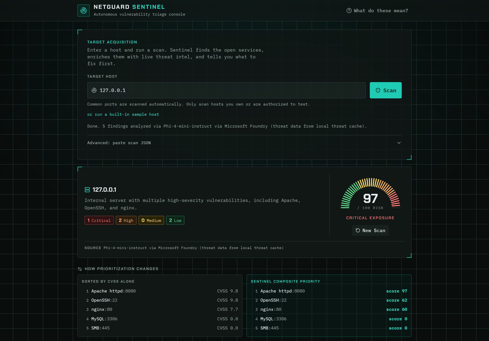

# NetGuard Sentinel

**Scan a host, get a ranked battle plan: every CVE scored by real-world exploitability, chained into an attack path, with the fix that breaks it first.**

[](LICENSE)
[](#quick-start)
[](#quick-start)

## What it does

Vulnerability scanners hand you a pile of CVEs sorted by CVSS, which tells you how bad a bug could be but not whether anyone is actually exploiting it. NetGuard Sentinel scans a host, fingerprints each service, and scores every matched CVE on three real-world signals at once: CVSS severity, EPSS exploit probability, and CISA Known Exploited Vulnerabilities status. A six-step agent pipeline then ranks findings worst-first, maps them to MITRE ATT&CK, and hands the enriched data to Phi-4-mini-instruct on Microsoft Foundry, which writes the likely attack path through the host and per-finding remediation ordered to break that path first. The result on the demo host: Apache 2.4.49 (CVE-2021-41773, on CISA KEV, EPSS ~0.97) ranks above higher-CVSS bugs that nobody is exploiting, which is the call a human analyst would make.

This project grew out of [NetGuard](https://github.com/aimannurzharfan/Network-Scanner), a Python port scanner written earlier as a learning project. That scanner found what was running; Sentinel decides what to do about it, with the scan step built in.

## Demo



Demo video: <link>

The screenshot shows the one-click localhost scan: three deliberately vulnerable services (Apache 2.4.49, OpenSSH 6.6.1p1, nginx 1.18.0), with the CISA KEV Apache bug at priority 1.

## How it works

Six stages, all automated:

1. **Port scan** -- threaded TCP connect scan, banner grab, service and version fingerprinted from the banner with regex (Apache/2.4.49, SSH-2.0-OpenSSH_6.6.1p1, nginx/1.18.0, etc.).
2. **Vulnerability enrichment** -- calls the `threat_intel_lookup` tool, which returns CVEs with CVSS base score (NVD), EPSS exploit probability (FIRST), and CISA KEV known-exploited status.
3. **Composite risk scoring** -- combines the three signals into a 0-100 score per CVE (formula below).
4. **Contextual prioritization** -- ranks findings worst-first. A reachable, actively-exploited medium outranks an unreachable critical.
5. **Attack-path reasoning** -- maps findings to MITRE ATT&CK techniques and chains them into the likely attacker path through the host.
6. **Remediation synthesis** -- writes a per-finding fix ordered to break the attack path first, plus a one-line host risk summary.

Output is strict JSON (schema in `agent/schema.py`).

### Hybrid design: deterministic core, Foundry reasoning

Stages 1-3 (parse, enrich, score) always run as deterministic Python so CVE data and composite scores are always authoritative. Stages 4-6 (prioritize, attack-path reasoning, remediation narrative) are handled by Phi-4-mini-instruct via Microsoft Foundry when `FOUNDRY_ENDPOINT`, `FOUNDRY_MODEL_DEPLOYMENT`, and `FOUNDRY_API_KEY` are set in `.env`. The deterministic pipeline is the fallback when Foundry is unconfigured or returns an error, so the demo never breaks.

Phi-4-mini-instruct reasons over the pre-enriched findings and returns contextual prioritization, an attack-path narrative, and per-finding remediation text. The model cannot change CVE scores, invent CVE IDs, or assign MITRE ATT&CK techniques -- those come only from the deterministic pipeline.

Threat enrichment itself has two swappable backends behind one tool interface: a local JSON cache built from NVD, EPSS, and CISA KEV feeds (default), and an Oracle 23ai container queried with AI Vector Search (`THREAT_BACKEND=oracle`).

### Composite scoring formula

```
composite = round(min(1, 0.30 * (cvss / 10) + 0.50 * epss + 0.20 * kev_flag) * 100)
```

CVSS contributes 30% (severity baseline). EPSS contributes 50% (real-world exploit probability, the most predictive signal). KEV contributes 20% (active exploitation confirmed by CISA). A CVSS 9.8 bug with no known exploits scores ~29; the same bug on KEV with EPSS 0.97 scores ~91.

### Network exposure override

The triage pipeline applies a context pass after composite scoring. When a scan includes exposure data (present in pre-built samples and added automatically by the scanner for IP addresses), two rules fire:

1. **Elevation**: sensitive data-store services (MySQL 3306, PostgreSQL 5432, Redis 6379, MongoDB 27017) with `bind_address == "0.0.0.0"` or `exposure == "internet"` are moved to the top of the priority list, ahead of CVE-scored services. These ports are dangerous regardless of whether a matching CVE is in the cache. The finding rationale says explicitly why the override fired.

2. **Downgrade**: SMB (port 445) on a confirmed internal host (`exposure == "internal"`) is deprioritised. Lateral-movement risk is lower when the host is not internet-reachable.

The override only fires on data actually present in the scan. A scan with no `exposure` field and no `bind_address` values is not modified. This is enforced in the code and verified by tests.

### Executable remediation commands

Each finding includes a `remediation_command` field: a single copy-pasteable shell command for the most urgent remediation step. Examples:

- Exposed Redis on 0.0.0.0: `sudo iptables -A INPUT -p tcp --dport 6379 -j DROP`
- Apache httpd: `sudo apt-get install --only-upgrade apache2`
- vsftpd 2.3.4 (backdoored): `sudo systemctl disable --now vsftpd`

The command is rendered in the UI as a monospace block under each finding. The longer human-readable `remediation` text is kept alongside it.

## Architecture


The whole pipeline runs on your machine. The web UI posts a target to the Flask server, which enforces the target policy and rate limit, runs the TCP scanner, and hands the scan JSON to the agent. The agent enriches each service through `threat_intel_lookup` (local CVE cache by default, Oracle 23ai AI Vector Search with `THREAT_BACKEND=oracle`), computes composite scores, then calls Microsoft Foundry (Phi-4-mini-instruct) for the attack-path narrative and remediation prose, falling back to the deterministic local pipeline when Foundry is unavailable. The same pipeline is reachable from the CLI with `python -m netguard_sentinel <host>`.

## Quick start

Requires Python 3.11 to 3.13. Python 3.14 is not yet supported because numpy and sentence-transformers do not ship 3.14 wheels. Docker Desktop is optional (Oracle Layer 2 and demo target only).

```bash
git clone https://github.com/aimannurzharfan/netguard-sentinel.git
cd netguard-sentinel

python -m venv .venv
.venv\Scripts\activate          # Windows
# source .venv/bin/activate     # Linux/macOS
pip install -r requirements.txt

cp .env.example .env
# Optional: set the FOUNDRY_* variables for AI reasoning (see below).
# Optional: set ORACLE_PASSWORD if you plan to use Layer 2.

# data/cache/cves.json ships committed for an offline deterministic demo.
# Run the line below only when you want to refresh it from NVD/EPSS/KEV.
# python -m data.fetch_cache

pytest                          # run the test suite
python -m web.server            # start the UI at http://localhost:5000
```

The built web UI ships in `web/dist`, so no Node.js or npm step is needed. To hack on the UI itself, run `npm install && npm run build` in `frontend/`.

### Demo: scan a deliberately vulnerable local target

`docker-compose.demo.yml` starts three deliberately old services on localhost, each on its own port and each bound to `127.0.0.1` so nothing is reachable off this host. One scan surfaces three CVE-bearing findings across three services, ranked worst-first. The Apache CISA KEV bug stays at priority 1, above the OpenSSH and nginx findings. Every banner reports a real version that its matched CVEs actually affect, so the demo uses only real vulnerability data (live NVD CVSS, FIRST EPSS, CISA KEV).

| Service | Image | Port | Banner reports | CVEs |
| --- | --- | --- | --- | --- |
| Apache httpd | `httpd:2.4.49` | 8080 | `Apache/2.4.49` | CVE-2021-41773, CVE-2021-42013 (CISA KEV) |
| OpenSSH | `rastasheep/ubuntu-sshd:14.04` | 22 | `OpenSSH_6.6.1p1` | CVE-2023-38408, CVE-2016-0777 |
| nginx | `nginx:1.18.0` | 80 | `nginx/1.18.0` | CVE-2021-23017 |

```bash
docker compose -f docker-compose.demo.yml up -d
python -m netguard_sentinel 127.0.0.1 --ports 22,80,8080
```

Or open http://localhost:5000, leave the host as `127.0.0.1`, and click **Scan**. The result appears in a few seconds with all three findings sorted by priority. Each finding only lists CVEs for its own product (the scanner matches on an exact product key, so an Apache query never returns an Apache Struts CVE).

### CLI usage

Scan and triage in one command:

```bash
python -m netguard_sentinel 127.0.0.1
python -m netguard_sentinel 127.0.0.1 --ports 22,80,8080   # exactly the demo ports
```

Scanner only (outputs raw scan JSON):

```bash
python -m scanner.scan 127.0.0.1
python -m scanner.scan 127.0.0.1 --ports 80,8080 --out scan.json
```

Triage only: start `python -m web.server`, then POST `/triage` with `{"scan": "<json>"}`.

### Enabling Foundry reasoning

Set three variables in `.env`:

```
FOUNDRY_ENDPOINT=https://<resource>.services.ai.azure.com/api/projects/<project>/openai/v1
FOUNDRY_MODEL_DEPLOYMENT=Phi-4-mini-instruct
FOUNDRY_API_KEY=<your key>
```

`FOUNDRY_PROJECT_ENDPOINT` is also accepted as a fallback -- the client appends `/openai/v1` automatically. With these set, `triage()` sends enriched findings to Phi-4-mini-instruct for stages 4-6 and falls back to the deterministic pipeline on any error.

### Switching threat backends

```bash
# Layer 1 (default): reads from data/cache/cves.json
THREAT_BACKEND=cache python -m web.server

# Layer 2: Oracle 23ai AI Vector Search
# Start Oracle first: docker compose up -d
# Load knowledge: python -m data.load_oracle
THREAT_BACKEND=oracle python -m web.server
```

Oracle defaults: user `system`, DSN `localhost:1521/FREEPDB1`. Only `ORACLE_PASSWORD` must be set in `.env`.

## Intended use and disclaimer

- NetGuard Sentinel was built for the Microsoft Agents League hackathon (AI Skills Fest 2026) as a demonstration and educational project.
- It is provided as-is, with no warranty of any kind. It is not intended for production security operations.
- This is a security scanning tool. Run it only against systems you own or are explicitly authorized to test. Unauthorized scanning may be illegal in your jurisdiction.
- The scanner defaults to localhost and private (RFC1918) ranges only. Scanning public targets requires setting the explicit `ALLOW_PUBLIC_TARGETS` flag, and doing so is entirely the user's responsibility.

See [NOTICE.md](NOTICE.md) for the short version and [LICENSE](LICENSE) for the MIT License text.

### Security posture

NetGuard Sentinel is a local tool, not a hosted service, and ships with no authentication layer by design.

- **Default-deny scan targets.** The scanner and the `/scan` endpoint accept only targets that resolve to localhost or RFC1918 private ranges (`10/8`, `172.16/12`, `192.168/16`, loopback). The host is validated, resolved through DNS, and the resolved IP is re-checked against the policy, so a public name cannot slip through by mapping to an internal address. Public targets are refused with a clear message. To scan a public host you are authorized to test, set `ALLOW_PUBLIC_TARGETS=1`; a one-line authorized-use warning is logged whenever the flag is active.
- **Socket-only scanning.** Probing uses plain TCP connect and banner reads. No user input ever reaches a shell, and there is no `subprocess` or `os.system` anywhere in the scan path. Scanning runs with bounded concurrency and per-connection socket timeouts so a scan cannot hang or exhaust resources.
- **Rate limit.** `/scan` is capped at 10 requests per minute per client by default, configurable with `SCAN_RATE_LIMIT`. Exceeding it returns HTTP 429. The limiter is in-process with no external dependency.
- **Server hardening.** Flask debug is off by default, request bodies are capped at 1 MB, error responses are generic with no stack traces, CORS is not enabled, and responses carry `X-Content-Type-Options: nosniff`, `X-Frame-Options: DENY`, and `Referrer-Policy: no-referrer`.
- **Secrets.** No secrets are committed. `.env`, `.mcp.json`, `_local/`, `.claude/`, and `node_modules/` are gitignored; `.env.example` holds placeholders only.

The localhost demo works one-click out of the box because `127.0.0.1` satisfies the default policy.

## Tech stack

| Layer | Technology |
| --- | --- |
| AI reasoning | Phi-4-mini-instruct on Microsoft Foundry (Azure AI Foundry, OpenAI-compatible API) |
| Threat data | NVD (CVSS), FIRST EPSS, CISA KEV |
| Vector search (Layer 2) | Oracle Database 23ai AI Vector Search, sentence-transformers embeddings |
| Backend | Python 3.11+, Flask |
| Scanner | Python standard library sockets (TCP connect, banner grab) |
| Frontend | React 19, TypeScript, Vite, Tailwind CSS |
| Tests and tooling | pytest, ruff, ty, ESLint |

## Repository layout

```
scanner/            TCP connect scanner, banner fingerprinting
netguard_sentinel/  End-to-end CLI entry point
agent/              Six-step triage pipeline, output schema, Foundry client
tools/              threat_intel tool, composite scoring, Oracle backend
data/               NVD/EPSS/KEV fetcher, Oracle loader, embedding module
samples/            Three scan files: badly exposed / moderate / clean
frontend/           React SPA source (built output ships in web/dist)
web/                Flask server and the built SPA
tests/              Unit and integration tests
docs/               Architecture diagram and demo screenshot
```

## License

MIT, see [LICENSE](LICENSE). Copyright (c) 2026 Aiman Nurzharfan.
